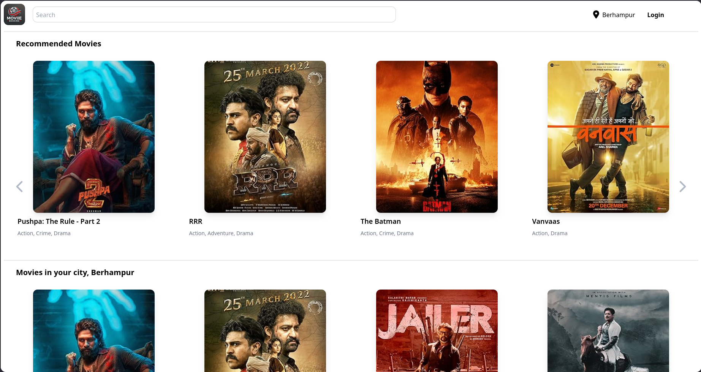
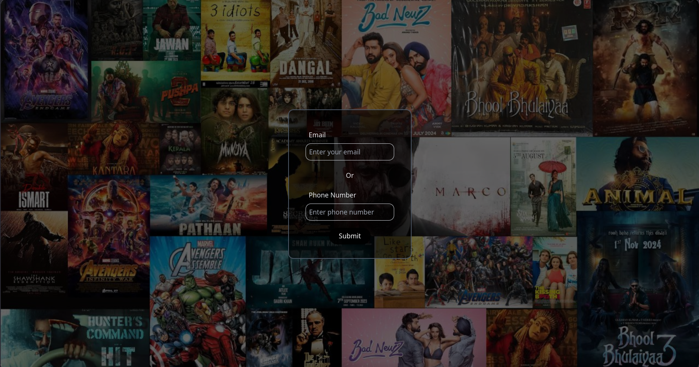
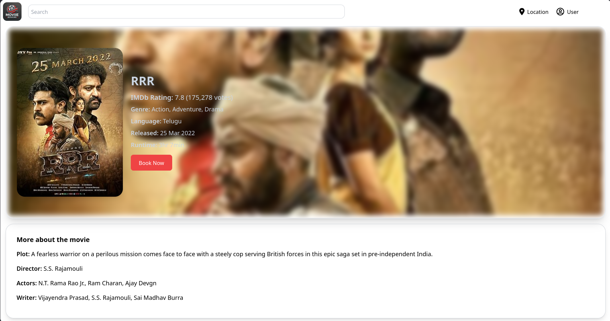
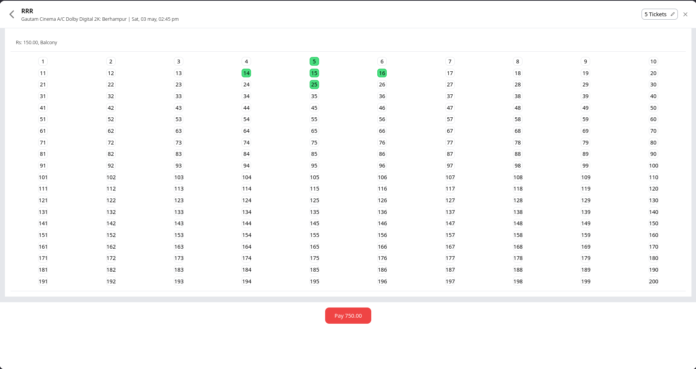
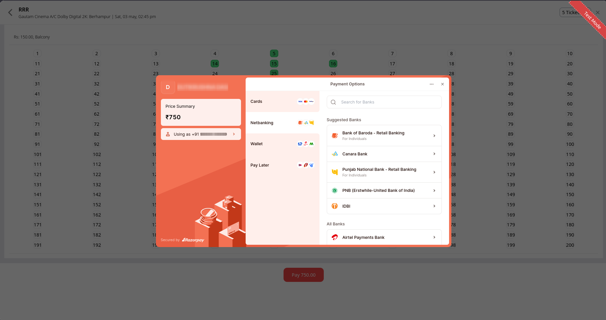
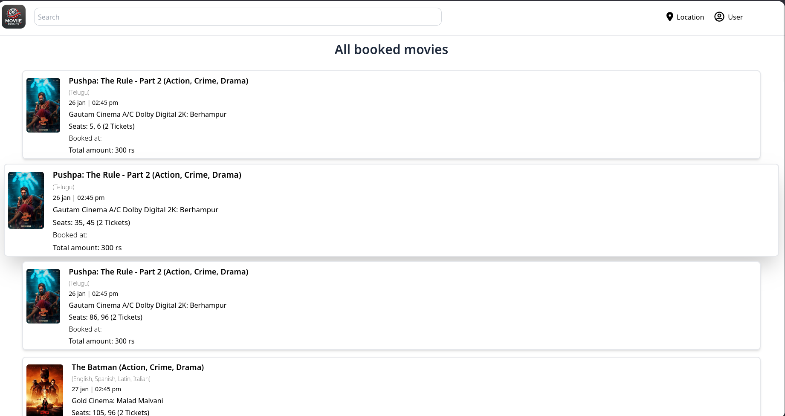

## 🎟️ TicketBooking

TicketBooking is a MERN-stack web application designed to streamline the process of booking tickets for various events. Built with a modern tech stack, it offers users an intuitive interface to browse events, select seats, and manage their bookings seamlessly.

## 🌐 Live Demo

Experience the application live: [ticketbooking-jvie.onrender.com](https://ticketbooking-jvie.onrender.com)

## 🚀 Features

    User Authentication: Secure registration and login functionalities.

    Seat Selection: Interactive seat maps for easy selection.

    Booking Management: View and manage your bookings.

    Responsive Design: Optimized for both desktop and mobile devices.

    Payment Gateways: Added payment methods for seat booking.

    Track Orders: Easily tarack booking of shows, time and seats.

 ## 🛠️ Tech Stack

    Frontend: React.js, Redux, Tailwind CSS

    Backend: Node.js, Express.js

    Database: MongoDB

    Deployment: Render

## 🧑‍💻 Getting Started 
( Follow these step you can easily run this project )
    
### Prerequisites

    -> Node.js and npm installed

    -> MongoDB instance running

### Installation

1. Clone the repository:
```bash
    git clone https://github.com/Skpanda0/TicketBooking.git
    cd TicketBooking
```
2. Setup Backend:
```bash
    cd backend
    npm install
    npm start
```
3. Setup Frontend:
```bash
    cd ../frontend
    npm install
    npm start
```
4. Access the application:

    Navigate to http://localhost:3000 in your browser.

### Setup Env variables
create a .env file in your backend folder and add this variables

```    
    EMAIL_PASS: "Nodemail email pass"

    EMAIL_USER: "Nodemail email user"
    
    keyid: "Your rozerpay keysecret"
    
    keysecret: "Your rozerpay keysecret"
    
    MONGO_URI: "Your mongodb URI"

    TWILIO_ACCOUNT_SID: "Your twilio SID"

    TWILIO_AUTH_TOKEN: "Your twilio TOKEN"

    TWILIO_PHONE_NUMBER: "Your twilio number"
```

## 📸 Screenshots
### Home page 
    

### Login page
    

### Movie Details page
    

### Seat Selection page
    

### Payment page
    

### All Orders page
    


## 🤝 Contributing

Contributions are welcome! Please fork the repository and submit a pull request for any enhancements or bug fixes.

### Credits 

## 📬 Contact

For any inquiries or feedback, please contact [Skpanda0](https://github.com/Skpanda0).